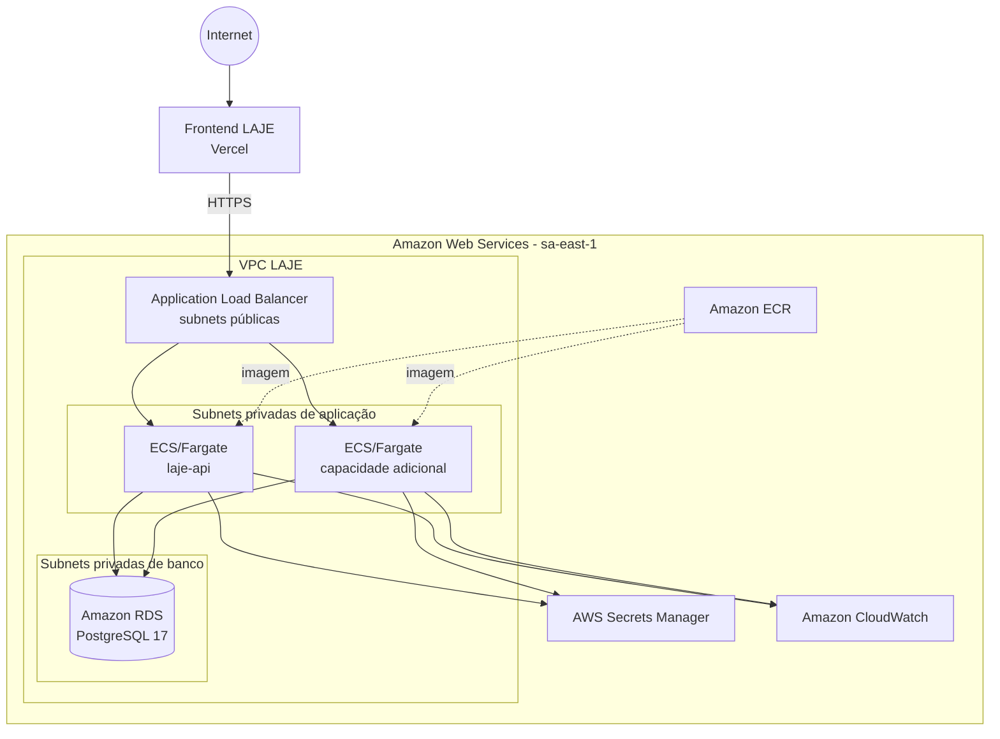
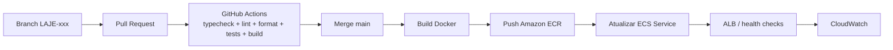

# Arquitetura operacional alvo do LAJE

> Status: decisão arquitetural para implementação incremental. Os recursos AWS descritos aqui representam o estado-alvo; o provisionamento começa na LAJE-127 e não é realizado pela LAJE-82.

## 1. Objetivo

Definir uma arquitetura operacional reproduzível para a migração do LAJE, separando claramente o frontend, a API, a persistência e os serviços operacionais. A solução preserva o frontend React/Vite no mesmo repositório `laje`, enquanto transfere o backend principal, regras de negócio e persistência para infraestrutura AWS controlada pelo projeto.

O estado-alvo é:

```text
Frontend React/Vite (Vercel)
        |
        | HTTPS / REST / realtime futuro
        v
Application Load Balancer (AWS)
        |
        v
laje-api (Amazon ECS + AWS Fargate)
        |
        +--------------------+
        |                    |
        v                    v
Amazon RDS              Serviços AWS
PostgreSQL 17           (Secrets Manager,
                        CloudWatch e, em etapas
                        posteriores, SQS/EventBridge)
```

## 2. Exceção arquitetural do frontend

O Portfolio Playbook público vigente classifica Vercel como `Não Usar` para a entrega final de Web Apps. O projeto LAJE possui, porém, uma decisão externa específica, já aprovada para este projeto, permitindo manter o frontend na Vercel.

Essa exceção não altera nem reinterpreta o conteúdo do Playbook. Ela deve ser tratada como uma decisão de governança específica do projeto e evidenciada separadamente na documentação/apresentação quando necessário.

Por isso:

- o frontend permanece na Vercel;
- o mesmo repositório `laje` continua sendo utilizado;
- `VITE_API_URL` seleciona a `laje-api` correspondente ao ambiente;
- Supabase deixa de ser o backend principal no estado final;
- API, banco, regras de negócio e serviços operacionais passam para a AWS.

## 3. Decisão de serviços AWS

| Responsabilidade                | Serviço / tecnologia escolhida | Decisão                                                                                                                  |
| ------------------------------- | ------------------------------ | ------------------------------------------------------------------------------------------------------------------------ |
| Runtime da API                  | Amazon ECS com AWS Fargate     | Executar containers sem manter servidor EC2, preservando controle de imagem, rede, task definition e deploy.             |
| Registry                        | Amazon ECR                     | Armazenar imagens versionadas da `laje-api`.                                                                             |
| Entrada HTTP/HTTPS              | Application Load Balancer      | Terminar TLS, executar health checks e encaminhar somente tráfego permitido para as tasks ECS.                           |
| Certificado TLS da API          | AWS Certificate Manager        | Certificado gerenciado para o domínio/subdomínio da API.                                                                 |
| Persistência                    | Amazon RDS for PostgreSQL 17   | Compatibilidade direta com o baseline PostgreSQL 17 e menor complexidade operacional que manter PostgreSQL em container. |
| Segredos                        | AWS Secrets Manager            | Credenciais de banco e segredos de integração ficam fora do GitHub e fora de variáveis públicas.                         |
| Logs e métricas                 | Amazon CloudWatch              | Logs da API, métricas de ECS/ALB/RDS e alarmes operacionais mínimos.                                                     |
| Processamento assíncrono futuro | Amazon SQS + DLQ               | Alvo da LAJE-126 para substituir filas/pgmq.                                                                             |
| Agendamentos futuros            | Amazon EventBridge Scheduler   | Alvo da LAJE-126 para substituir `pg_cron` operacional.                                                                  |
| CI/CD                           | GitHub Actions + OIDC para AWS | Evitar access keys AWS de longa duração no GitHub; build, push da imagem e deploy automatizado.                          |

### Por que ECS/Fargate

A API já foi concebida como Node.js/Express e será containerizada. ECS/Fargate mantém o artefato de execução explícito (imagem Docker), permite health checks, rolling deployment, escalabilidade por task e integração direta com ALB, ECR, Secrets Manager e CloudWatch.

O deploy inicial utilizará rolling deployment. Blue/green continua possível como evolução, mas adiciona complexidade e custo que não são necessários para a primeira entrega da migração.

### Por que RDS PostgreSQL e não Aurora

O banco atual é pequeno e já usa PostgreSQL 17. A prioridade é compatibilidade, previsibilidade e simplicidade de migração. RDS for PostgreSQL atende ao baseline atual sem introduzir uma camada adicional de compatibilidade ou custo operacional do Aurora.

O baseline versionado em `infra/database/baseline/schema.sql` permanece a origem para inicializar bancos vazios da nova arquitetura.

## 4. Região AWS

A região alvo é **`sa-east-1` (São Paulo)**.

Motivos:

- usuários e operação principal do LAJE estão no Brasil;
- menor distância de rede entre usuários/operadores e a API;
- simplifica a justificativa de localização operacional dos dados no Brasil;
- todos os componentes centrais escolhidos possuem oferta compatível na região.

Trade-off: `sa-east-1` pode ter preços superiores a regiões dos Estados Unidos. O projeto aceita esse custo em troca de menor latência e de uma arquitetura mais coerente com o público atendido. A LAJE-127 deve registrar os tamanhos efetivamente contratados e a estimativa do AWS Pricing Calculator antes do provisionamento definitivo.

## 5. Rede e isolamento

A arquitetura AWS usa uma VPC distribuída em pelo menos duas Availability Zones.



### Security Groups

- **ALB SG:** entrada pública apenas em `443`; `80` pode existir somente para redirecionamento para HTTPS.
- **ECS SG:** recebe tráfego da porta da aplicação somente a partir do Security Group do ALB.
- **RDS SG:** recebe `5432` somente do Security Group das tasks ECS e, durante migrações controladas, de uma origem administrativa temporária explicitamente autorizada.
- não usar `0.0.0.0/0` para PostgreSQL;
- acesso administrativo temporário deve ser removido após os ensaios/migração.

As tasks ECS permanecem em subnets privadas no desenho final. O mecanismo de saída dessas subnets (NAT Gateway ou endpoints VPC necessários) será materializado junto do provisionamento e deve privilegiar o menor custo que mantenha ECR, Secrets Manager, CloudWatch e demais dependências acessíveis sem expor portas de entrada das tasks.

## 6. Banco de dados

### Staging/integration

- RDS PostgreSQL 17 dedicado ao ambiente de integração;
- Single-AZ inicialmente;
- criptografia em repouso habilitada;
- TLS obrigatório nas conexões;
- backups automáticos habilitados;
- banco inicializado pelo baseline da LAJE-112;
- dados de ensaio tratados como descartáveis até a validação da LAJE-88.

### Produção

Antes do cutover, deve existir uma instância RDS de produção separada do staging, com credenciais distintas e sem compartilhamento do banco lógico com o ambiente de testes.

Para o porte atual do LAJE, a decisão inicial é **Single-AZ com backups automáticos, snapshots antes de mudanças destrutivas e deletion protection em produção**. Multi-AZ fica registrado como evolução quando disponibilidade exigida, volume ou orçamento justificarem o custo adicional.

A aplicação deve usar conexão TLS. RDS for PostgreSQL suporta SSL/TLS e o projeto deve validar certificado/endpoint no cliente PostgreSQL sempre que a biblioteca adotada permitir configuração equivalente a `verify-full`.

## 7. Ambientes

A migração usa três estados operacionais claramente distintos.

### Produção legada durante a migração

```text
Vercel atual -> Supabase
```

É o ambiente hoje utilizado pelos usuários e não deve ser alterado por LAJE-82/LAJE-127.

### Integration / staging AWS

```text
Projeto Vercel dedicado ou ambiente equivalente
mesmo repositório laje
VITE_API_URL=https://<api-staging>
        |
        v
ECS/Fargate staging
        |
        v
RDS PostgreSQL staging
```

Esse ambiente serve para:

- validar a `laje-api`;
- testar o baseline e migrations;
- ensaiar importação de dados;
- executar testes integrados sem afetar o Supabase de produção;
- validar CORS, TLS, health checks, logging e deploy.

### Produção alvo

```text
Vercel produção
mesmo repositório laje
VITE_API_URL=https://<api-producao>
        |
        v
ALB -> ECS/Fargate produção -> RDS PostgreSQL produção
```

O frontend deixa de acessar Supabase como backend principal após o cutover. Dependências transitórias só podem permanecer quando explicitamente mapeadas por uma tarefa de migração ainda aberta.

## 8. CORS, TLS e URLs

### CORS

A `laje-api` deve manter allowlist explícita por ambiente.

- staging: somente origem do frontend de staging aprovado;
- produção: somente domínio(s) produtivo(s) do frontend;
- localhost pode ser permitido apenas em desenvolvimento;
- não usar `Access-Control-Allow-Origin: *` em endpoints autenticados;
- credentials/cookies, se adotados, exigem origem exata e política compatível.

### TLS

- navegador -> Vercel: HTTPS fornecido pelo frontend;
- Vercel/browser -> API: HTTPS terminado no ALB com certificado ACM;
- API -> RDS: PostgreSQL sobre TLS;
- nenhuma credencial deve trafegar por HTTP em produção/staging.

### Variáveis

Frontend, públicas no bundle:

```text
VITE_API_URL
```

Backend, privadas:

```text
DATABASE_URL ou parâmetros equivalentes
AUTH/JWT secrets
BREVO/API secrets quando aplicável
AWS configuration que não seja obtida via IAM role
```

Segredos de backend ficam no Secrets Manager e são entregues às tasks por IAM/task role; não são versionados no repositório.

## 9. CI/CD



Regras:

- PR não realiza deploy de produção;
- merge em `main` só pode acionar deploy quando o workflow AWS real estiver configurado;
- autenticação GitHub -> AWS deve usar OIDC/role de menor privilégio;
- não armazenar AWS access key permanente em secrets do GitHub quando OIDC atender ao fluxo;
- o placeholder atual de deploy é tratado separadamente pela LAJE-129;
- rollback deve permitir voltar para uma task definition/imagem anterior.

## 10. Observabilidade

Baseline operacional:

- logs estruturados da API no CloudWatch Logs;
- métricas de CPU/memória/tasks do ECS;
- métricas e health checks do ALB;
- métricas de conexões, armazenamento e carga do RDS;
- alarmes mínimos para indisponibilidade da API, tasks não saudáveis e pressão relevante no banco;
- correlação por request/correlation ID na API quando a camada HTTP for implementada.

A LAJE-40 detalhará dashboards, retenção, alertas e evidências para a banca.

## 11. Fluxos arquiteturais principais

### Consulta pública

```text
Browser -> Vercel -> laje-api -> RDS -> laje-api -> Browser
```

### Administração

```text
Browser -> Vercel -> laje-api
                     | autenticação/autorização
                     v
                    RDS
```

### Atualização ao vivo

A tecnologia definitiva é escopo da LAJE-89. A decisão deve preservar o caminho `frontend -> laje-api -> infraestrutura controlada`, sem reintroduzir Supabase Realtime como dependência principal do estado final.

### Processamento assíncrono

A LAJE-126 migrará os fluxos de filas, cron e Edge Functions para `laje-api` + SQS/DLQ + EventBridge Scheduler, usando Secrets Manager e CloudWatch.

## 12. Justificativa financeira

A arquitetura evita superdimensionamento no início:

- ECS/Fargate evita manter capacidade EC2 ociosa e reduz administração de servidores;
- staging começa com uma task e pode escalar somente quando necessário;
- produção pode iniciar com uma task e aumentar `desiredCount` durante eventos de maior tráfego;
- RDS usa PostgreSQL padrão e Single-AZ inicialmente, evitando custo de Aurora/Multi-AZ antes de existir justificativa de disponibilidade;
- staging e produção usam bancos separados para evitar risco operacional, mas o staging pode ser reduzido/desligado fora das janelas de migração quando tecnicamente seguro;
- logs devem ter retenção definida para não crescer indefinidamente;
- NAT Gateway, ALB, armazenamento, logs e transferência de dados devem entrar explicitamente na estimativa, pois podem representar parcela relevante do custo mesmo com baixa carga;
- tags de custo devem separar `Project=LAJE` e `Environment=staging|production`;
- AWS Budgets deve ser configurado no provisionamento para alertar sobre desvio de gasto.

Não se fixa um valor mensal neste ADR porque preços e classes disponíveis mudam por região e data. A LAJE-127 deve registrar o dimensionamento escolhido e a estimativa gerada no AWS Pricing Calculator antes de consolidar o ambiente.

## 13. Riscos e trade-offs

| Risco / trade-off                                         | Mitigação                                                                                              |
| --------------------------------------------------------- | ------------------------------------------------------------------------------------------------------ |
| Exceção de Vercel diverge do Playbook público             | Registrar explicitamente a autorização externa específica e manter evidência disponível para banca.    |
| Single-AZ não oferece failover automático de banco        | Backups, snapshots, restore testado; avaliar Multi-AZ quando disponibilidade justificar.               |
| Uma única task de produção reduz redundância              | ECS repõe task não saudável; aumentar `desiredCount` para 2 em eventos críticos ou conforme orçamento. |
| NAT/VPC endpoints adicionam custo fixo                    | Dimensionar na LAJE-127 e selecionar a opção mais econômica que mantenha tasks privadas.               |
| Migração pode introduzir divergência entre Supabase e RDS | Ensaios repetíveis, validação de contagens/integridade e cutover/rollback na LAJE-88.                  |
| CORS/configuração incorreta pode bloquear frontend        | Allowlist por ambiente, testes integrados e healthchecks antes do cutover.                             |

## 14. Dependências de implementação

- **LAJE-127:** provisionar AWS/RDS de integration/staging e aplicar o baseline;
- **LAJE-131:** containerizar a `laje-api` para execução em AWS;
- **LAJE-107:** conexão PostgreSQL/repositories;
- **LAJE-109:** healthchecks da API e banco;
- **LAJE-84 a LAJE-87:** contratos e migração dos domínios;
- **LAJE-89:** realtime;
- **LAJE-126:** filas, cron e Edge Functions;
- **LAJE-88:** migração de dados, ensaios, cutover e rollback;
- **LAJE-33:** CI/CD multi-repositório;
- **LAJE-40:** observabilidade final;
- **LAJE-37 / LAJE-42:** documentação final e evidências arquiteturais.

## 15. Referências técnicas

- Portfolio Playbook — Web Apps: https://github.com/CatolicaSC-Portfolio/The-Portfolio-Playbook/blob/main/directions/portfolio-directions-webapp.md
- Portfolio Playbook — Geral: https://github.com/CatolicaSC-Portfolio/The-Portfolio-Playbook/blob/main/directions/portfolio-directions-GERAL.md
- Amazon RDS for PostgreSQL versions: https://docs.aws.amazon.com/AmazonRDS/latest/PostgreSQLReleaseNotes/postgresql-versions.html
- Amazon RDS PostgreSQL SSL/TLS: https://docs.aws.amazon.com/AmazonRDS/latest/UserGuide/PostgreSQL.Concepts.General.Security.html
- Amazon ECS deployment workflow: https://docs.aws.amazon.com/AmazonECS/latest/developerguide/blue-green-deployment-how-it-works.html

A decisão resumida e seus trade-offs formais estão registrados em `docs/adr/0001-arquitetura-operacional-final.md`.
